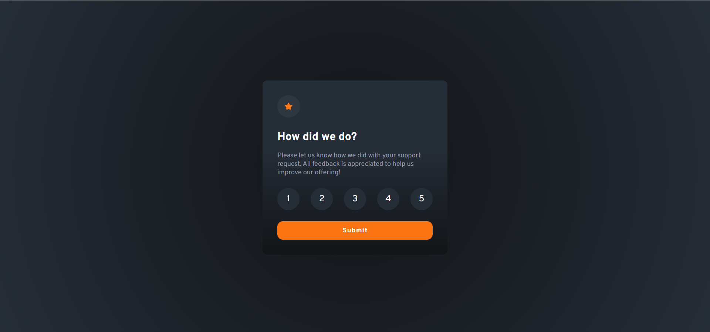

# Frontend Mentor - QR code component solution

This is a solution to the [Interactive rating component](https://www.frontendmentor.io/challenges/interactive-rating-component-koxpeBUmI). Frontend Mentor challenges help you improve your coding skills by building realistic projects.

## Table of contents

- [Overview](#overview)
  - [Screenshot](#screenshot)
  - [Links](#links)
- [My process](#my-process)
  - [Built with](#built-with)
  - [What I learned](#what-i-learned)
  - [Continued development](#continued-development)
- [Author](#author)

## Overview

### Screenshot

### Links

- Solution URL: [github](https://github.com/Fabzus/Interactive-rating-component)
- Live Site URL: [github](https://fabzus.github.io/Interactive-rating-component/)

## My process

### Built with

- Semantic HTML5 markup
- CSS custom properties
- Flexbox
- Javascript
- DOM

### What I learned

- a greater understanding of DOM
- getting familiar with CSS and HTML

### Continued development
- I would like to remove the hard coding for the rating radio buttons

- I would like to add some animations for when the cards are changing

## Author

- Balog Alin
- linkedIn - [@alinbalog](https://www.linkedin.com/in/alinbalog/)
- github - [@Fabzus](https://github.com/Fabzus)
- Frontend Mentor - [@Fabzus](https://www.frontendmentor.io/profile/Fabzus)
